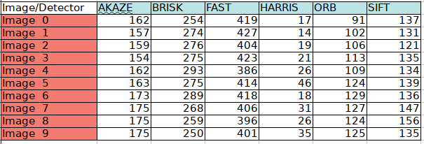
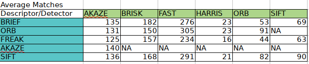
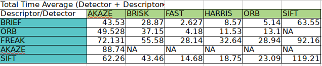

# SFND 2D Feature Tracking


## Performance Detectors


Mid-Term Report Specifications

MP.1 Data Buffer Opt 

```
// push image into data frame buffer
        DataFrame frame;
        frame.cameraImg = imgGray;
        if (dataBuffer.size() == dataBufferSize)
            dataBuffer.erase(dataBuffer.begin());

        dataBuffer.push_back(frame);
```

MP.2 Keypoint Detection

```
        string detectorType = "SIFT";
        bool bVisKey = false;

        double t_detector; //time detector ms

        if (detectorType.compare("SHITOMASI") == 0)
        {
            detKeypointsShiTomasi(keypoints, imgGray, t_detector, bVisKey);
        }
        else if (detectorType.compare("HARRIS") == 0)
        {
            detKeypointsHarris(keypoints,imgGray, t_detector, bVisKey);
        }
        else
        {
            detKeypointsModern(keypoints, imgGray, detectorType,t_detector, bVisKey);
        }
```

```
void detKeypointsModern(std::vector<cv::KeyPoint> &keypoints, cv::Mat &img, std::string detectorType, double &t_detector, bool bVis)
{

    cv::Ptr<cv::FeatureDetector> detector;

    if (detectorType.compare("FAST") == 0)
    {
        detector = cv::FastFeatureDetector::create();
    }
    else if (detectorType.compare("BRISK") == 0)
    {
        detector = cv::BRISK::create();
    }
```
...
```
   detector->detect(img,keypoints);
```

MP.3

```
for (auto it = keypoints.begin(); it != keypoints.end(); ++it)
            {

                if (vehicleRect.contains(cv::Point2i(int(it->pt.x),int(it->pt.y))))
                {
                    cropkeypoints.push_back(*it);
                }
            }

            keypoints = cropkeypoints;
```

MP.4

```
    string descriptorType = "ORB"; // BRIEF, ORB, FREAK, AKAZE, SIFT
    descKeypoints((dataBuffer.end() - 1)->keypoints, (dataBuffer.end() - 1)->cameraImg, descriptors, descriptorType, t_descriptor);
```

```
void descKeypoints(vector<cv::KeyPoint> &keypoints, cv::Mat &img, cv::Mat &descriptors, string descriptorType, double &t_descriptor)
{
    // select appropriate descriptor
    cv::Ptr<cv::DescriptorExtractor> extractor;  // DescriptorExtractor and Feature Extractor has the same typedef
    if (descriptorType.compare("BRISK") == 0)
    {

        int threshold = 30;        // FAST/AGAST detection threshold score.
        int octaves = 3;           // detection octaves (use 0 to do single scale)
        float patternScale = 1.0f; // apply this scale to the pattern used for sampling the neighbourhood of a keypoint.

        extractor = cv::BRISK::create(threshold, octaves, patternScale);
    }
    else if (descriptorType.compare("ORB") == 0)
    {
        extractor = cv::ORB::create(); //Object created here can access detect and compute indifferently
    }
```
...
```
    extractor->compute(img, keypoints, descriptors);
```
MP.5

```
void matchDescriptors(std::vector<cv::KeyPoint> &kPtsSource, std::vector<cv::KeyPoint> &kPtsRef, cv::Mat &descSource, cv::Mat &descRef,
                      std::vector<cv::DMatch> &matches, std::string descriptorType, std::string matcherType, std::string selectorType)
{
    // configure matcher
    bool crossCheck = false;
    cv::Ptr<cv::DescriptorMatcher> matcher;

    if (matcherType.compare("MAT_BF") == 0)
    {
        int normType = descriptorType.compare("DES_BINARY") == 0 ? cv::NORM_HAMMING : cv::NORM_L2;
        matcher = cv::BFMatcher::create(normType, crossCheck);
    }
    else if (matcherType.compare("MAT_FLANN") == 0)
    {
        // ...
        if (descSource.type() != CV_32F)
        { // OpenCV bug workaround : convert binary descriptors to floating point due to a bug in current OpenCV implementation
            descSource.convertTo(descSource, CV_32F);
            descRef.convertTo(descRef, CV_32F);
        }

        //... TODO : implement FLANN matching
        //int normType = descriptorType.compare("DES_BINARY") == 0 ? cv::NORM_HAMMING : cv::NORM_L2;

        matcher = cv::FlannBasedMatcher::create(); //Function Create

        cout << "FLANN matching";
    }
```

MP.6

```
else if (selectorType.compare("SEL_KNN") == 0)
    { // k nearest neighbors (k=2)

        // ...
        std::vector< std::vector<cv::DMatch> > knn_matches;
        int k = 2;
        matcher->knnMatch( descSource, descRef, knn_matches, k );

        const float ratio_thresh = 0.8f;
        for (size_t i = 0; i < knn_matches.size(); i++)
        {
            if (knn_matches[i][0].distance < ratio_thresh * knn_matches[i][1].distance)
            {
                matches.push_back(knn_matches[i][0]);
            }
        }
```

MP.7


MP.8

Showing the average matches of all 9 images with different combinations of detector/descriptor



Note:: Apparently Akaze descriptor only works when using an AKAZE detector hence the NA on those cells.

MP.9

Showing the average total time (Detector+Descriptor) for all images.



