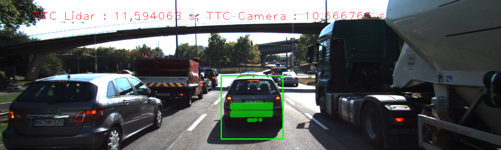
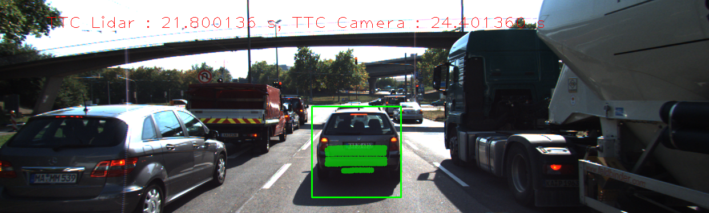
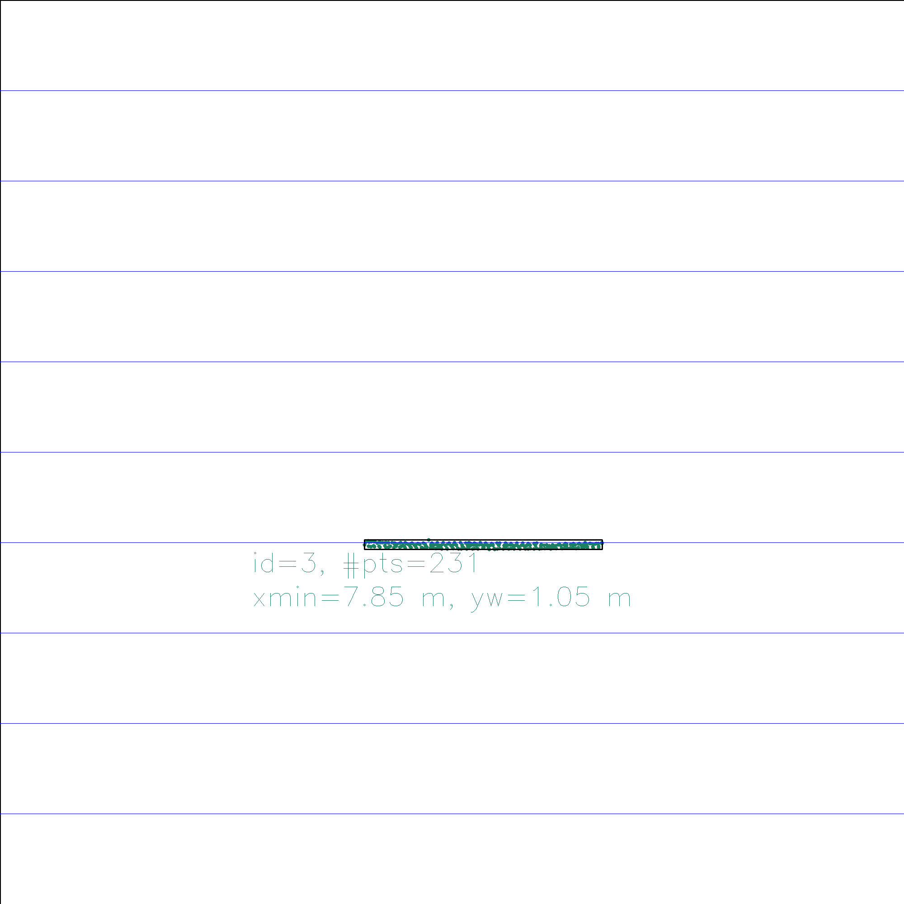
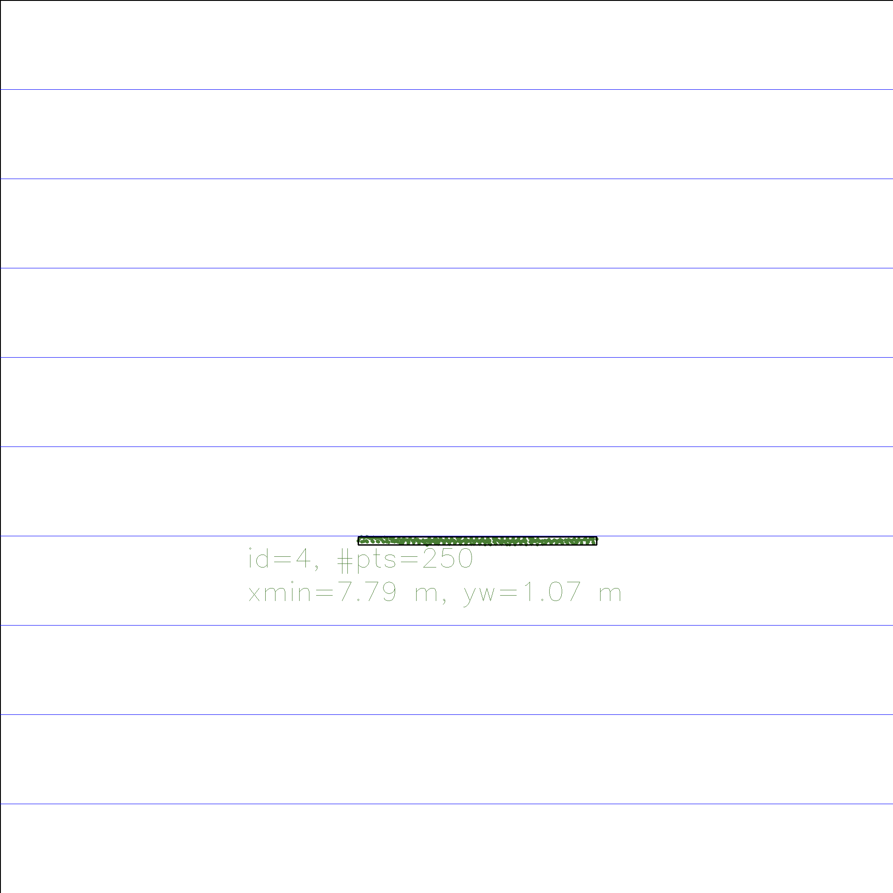
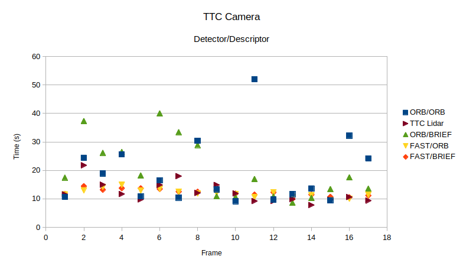

# SFND 3D Object Tracking

### **FP.1**

As a first step I used the variable class_ID inside the class keypoint to store the box ID it belongs to for further proccessing.

```
//Insert keypoint into each respective bounding box
        for (auto keypoint = (dataBuffer.end() - 1)->keypoints.begin(); keypoint != (dataBuffer.end() - 1)->keypoints.end(); keypoint++)
        {
            vector<vector<BoundingBox>::iterator> enclosingBoxes; // pointers to all bounding boxes which enclose the current keypoint
            for (auto bBox = (dataBuffer.end() - 1)->boundingBoxes.begin(); bBox != (dataBuffer.end() - 1)->boundingBoxes.end(); bBox++)
            {
                if (bBox->roi.contains(keypoint->pt))
                {
                    enclosingBoxes.push_back(bBox);
                }
            }

            if (enclosingBoxes.size() == 1)
            {
                // add Keypoint to bounding box
                enclosingBoxes[0]->keypoints.push_back(*keypoint);
                keypoint->class_id= enclosingBoxes[0]->boxID;  //Using the class_id variable in keypoint to store the box ID it belongs to.
            }

        }

```


Secondly I created a vector containing all pair matches using the box ID of each keypoint.
```
std::vector<std::pair<int,int>> boxID_vec;


    for (auto mtch = matches.begin(); mtch != matches.end() ; mtch++)
    {

        auto key_curr_ID = currFrame.keypoints.at(mtch->trainIdx).class_id;
        auto key_prev_ID = prevFrame.keypoints.at(mtch->queryIdx).class_id;

        boxID_vec.emplace_back(key_prev_ID,key_curr_ID);

    }


```

Thirdly I created a new vector with the most frequent pairs found in the vector created in the previous step. 

```
int max_count = 1, res = boxID_vec[0].second, curr_count = 1;
    for (int i = 1; i < boxID_vec.size(); i++)
    {

        if (boxID_vec[i].first == boxID_vec[i - 1].first)
        {

            if (boxID_vec[i].second == boxID_vec[i - 1].second)
                curr_count++;
            else
            {
                if (curr_count > max_count)
                {
                    max_count = curr_count;
                    res = boxID_vec[i - 1].second;
                }

                curr_count = 1;
            }

        }
        else
        {
            // If last element is most frequent
            if (curr_count > max_count)
            {
                max_count = curr_count;
                res = boxID_vec[i-1].second;
            }

            if (res != -1 and boxID_vec[i-1].first != -1)
                bbBestMatches.insert(std::pair<int, int>(boxID_vec[i-1].first, res));

            max_count = 1;
            res =  boxID_vec[i].second;
            curr_count = 1;

        }

    }

    // If last element is most frequent
    if (curr_count > max_count)
    {
        max_count = curr_count;
        res = boxID_vec[boxID_vec.size()-1].second;
    }

    if (res != -1 and boxID_vec[boxID_vec.size()-1].first != -1)
        bbBestMatches.insert(std::pair<int, int>(boxID_vec[boxID_vec.size()-1].first, res));
        
```

## **FP.2**

For calculating TTC from lidar I used the code developed in previous lessons with the addition of the calculation of average and standard deviation of coordinate x in lidar points  to remove outliers

```
// auxiliary variables
    double dT = 1 / frameRate;        // time between two measurements in seconds

    double mean_prev_x;
    double mean_curr_x;
    double std_prev_x;
    double std_curr_x;

    double factorSTD = 1;

    averageLidarPointsX(lidarPointsPrev, mean_prev_x, std_prev_x);
    averageLidarPointsX(lidarPointsCurr, mean_curr_x, std_curr_x);


    // find closest distance to Lidar points within bounding box
    double minXPrev = 1e9, minXCurr = 1e9;
    for (auto & it : lidarPointsPrev)
    {
        if (abs(it.x - mean_prev_x) < factorSTD*std_prev_x )
            minXPrev = minXPrev > it.x ? it.x : minXPrev;
    }

    for (auto & it : lidarPointsCurr)
    {
        if (abs(it.x - mean_curr_x) < factorSTD*std_curr_x )
            minXCurr = minXCurr > it.x ? it.x : minXCurr;
    }

    // compute TTC from both measurements
    TTC = minXCurr * dT / (minXPrev - minXCurr);
    
```


```

void averageLidarPointsX(std::vector<LidarPoint> &lidarPoints, double &averageLidar, double &standardDeviation)
{

    double sum=0;

    for (auto & lidarPoint : lidarPoints)
    {
        sum += lidarPoint.x;
    }

    averageLidar = sum / lidarPoints.size();

    sum=0;

    for (auto & lidarPoint : lidarPoints)
        sum += pow(lidarPoint.x - averageLidar, 2);

    standardDeviation = sqrt(sum / lidarPoints.size());


}

```

# **FP.3**

To associate matches to bounding boxes we first calculate the euclidean distance between the current and the previous hoping to get a rigid transform between frames. And then proceed to caclulate average and standard deviation of the vector of distances in the bounding box.

```
void clusterKptMatchesWithROI(BoundingBox &boundingBox, std::vector<cv::KeyPoint> &kptsPrev, std::vector<cv::KeyPoint> &kptsCurr, std::vector<cv::DMatch> &kptMatches)
{

    double distance;
    double stddev = 0;
    int factorSTD = 1;

    std::vector<double> distances;

    for (auto mtch = kptMatches.begin(); mtch != kptMatches.end() ; mtch++)
    {
        auto key_curr = kptsCurr.at(mtch->trainIdx);
        auto key_prev = kptsPrev.at(mtch->queryIdx);

        //Calculate euclidean distances between matched keypoints in previous frame and current frame
        // we expect the motion of the keypoints between frames to be represented by a rigid transform

        if (boundingBox.roi.contains(key_curr.pt))
        {
            distance = cv::norm(key_curr.pt - key_prev.pt);
            distances.push_back(distance);
        }
    }

    double average_distance = std::accumulate(distances.begin(),distances.end(), 0.0) / distances.size();

    for (auto & it_distance : distances)
        stddev += pow(it_distance - average_distance, 2);

    stddev = sqrt(stddev / distances.size());
```


We then proceed to push back the matches to each respective bounding box, filtering out matches that are outliers.

```


    for (auto mtch = kptMatches.begin(); mtch != kptMatches.end() ; mtch++)
    {

        auto key_curr = kptsCurr.at(mtch->trainIdx);
        auto key_prev = kptsPrev.at(mtch->queryIdx);

        if (boundingBox.roi.contains(key_curr.pt))
        {
            if (abs(cv::norm(key_curr.pt - key_prev.pt) - average_distance) < factorSTD*stddev)
            {
                boundingBox.kptMatches.push_back(*mtch);
            }

        }

    }

```

## **FP.4**

To calculate TTC with camera we use the median to deal with outlier correspondences.

```
void computeTTCCamera(std::vector<cv::KeyPoint> &kptsPrev, std::vector<cv::KeyPoint> &kptsCurr, 
                      std::vector<cv::DMatch> kptMatches, double frameRate, double &TTC, cv::Mat *visImg)
{

    // compute distance ratios between all matched keypoints
    vector<double> distRatios; // stores the distance ratios for all keypoints between curr. and prev. frame
    for (auto it1 = kptMatches.begin(); it1 != kptMatches.end() - 1; ++it1)
    { // outer keypoint loop

        // get current keypoint and its matched partner in the prev. frame
        cv::KeyPoint kpOuterCurr = kptsCurr.at(it1->trainIdx);
        cv::KeyPoint kpOuterPrev = kptsPrev.at(it1->queryIdx);

        for (auto it2 = it1 + 1; it2 != kptMatches.end(); ++it2) //No deberia ser it2 = it1 + 1  (?)
        { // inner keypoint loop

            double minDist = 100.0; // min. required distance

            // get next keypoint and its matched partner in the prev. frame
            cv::KeyPoint kpInnerCurr = kptsCurr.at(it2->trainIdx);
            cv::KeyPoint kpInnerPrev = kptsPrev.at(it2->queryIdx);

            // compute distances and distance ratios
            double distCurr = cv::norm(kpOuterCurr.pt - kpInnerCurr.pt);
            double distPrev = cv::norm(kpOuterPrev.pt - kpInnerPrev.pt);

            if (distPrev > std::numeric_limits<double>::epsilon() && distCurr >= minDist)
            { // avoid division by zero

                double distRatio = distCurr / distPrev;
                distRatios.push_back(distRatio);
            }
        } // eof inner loop over all matched kpts
    }     // eof outer loop over all matched kpts

    // only continue if list of distance ratios is not empty
    if (distRatios.size() == 0)
    {
        TTC = NAN;
        return;
    }

    // compute camera-based TTC from distance ratios
    double meanDistRatio = std::accumulate(distRatios.begin(), distRatios.end(), 0.0) / distRatios.size();

    std::sort(distRatios.begin(),distRatios.end());

    double medianDistRatio;
    if (distRatios.size() % 2 != 0)
        medianDistRatio = (double)distRatios[distRatios.size() / 2];
    else
        medianDistRatio = (double)(distRatios[(distRatios.size() - 1) / 2] + distRatios[distRatios.size() / 2]) / 2.0;


    double dT = 1 / frameRate;
    TTC = -dT / (1 - medianDistRatio);
}


```

## **FP.5**






Between these two frames we see a 100% increase in TTC. If we look at the top view images from lidar we see that the delta in the denominator of the TTC calculation taking into account all values is the same but because we did fltering using the standard deviation we dont use the overall minimum point.

If we use the overall minimum coordinate in x we get a TTC of 13.91 seconds instead of 21 seconds.





## **FP.6**

In this graph we can compare TTC from different descriptor/detector combinations and compare them frame by frame including the TTC coming from the Lidar. Two of the combinations that showed a more stable measurement along frames was the FAST/ORB and FAST/BRIEF combination with a small error with respect to the TTC Lidar. 


